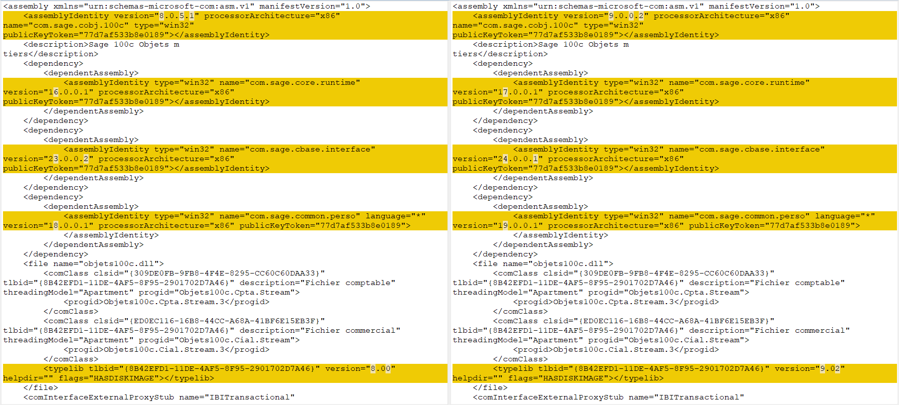

# POC

## Open dev cmd VS

"Tools" => "Command line" > "Tools for devs"

### Generate signing key

#### Generate private key

```
sn -k DummyKey.key
```

#### Extract public key

```
sn -p DummyKey.key DummyPublic.key
sn -tp DummyPublic.key
```

### Check manifest

```
ildasm
```

### Deep debug

```
SxsTrace Trace -logfile:SxsTrace.etl
```

Then press Return and :

```
sxstrace Parse -logfile:SxSTrace.etl -outfile:SxSTrace.txt
SxSTrace.txt
```

## Manifest diff

